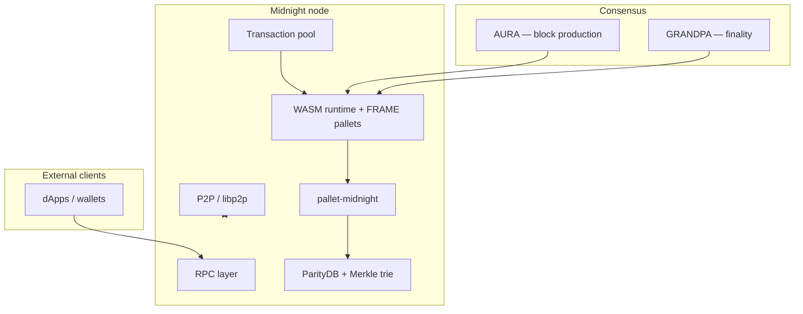

# Midnight Node Architecture

Midnight is a **Cardano Partnerchain** built on the **Polkadot SDK**. The node stack spans consensus, cryptography, on-chain execution, networking, RPC, storage, and a proof-based transaction model.

## Full stack map



## Topic skills

| Topic | Skill folder | Covers |
|-------|--------------|--------|
| Consensus | `midnight-consensus/` | AURA, GRANDPA, SPO validator selection |
| Cryptography | `midnight-cryptography/` | Blake2-256, sr25519, ECDSA, Ed25519, twoxhash |
| Onchain logic | `midnight-onchain-logic/` | WASM runtime, FRAME, pallet-midnight |
| P2P networking | `midnight-p2p-networking/` | Discovery, transport, gossip |
| RPC | `midnight-rpc/` | JSON-RPC for state and system queries |
| Storage | `midnight-storage/` | ParityDB, trie, state roots |
| Transactions | `midnight-transactions/` | Proof-based tx lifecycle |

Browse these on MIDSKILLS under **Foundation**, or install with:

```bash
npx skills add Kali-Decoder/Midnight-skills
```

Learning path: **Midnight node architecture** (`/paths`).
